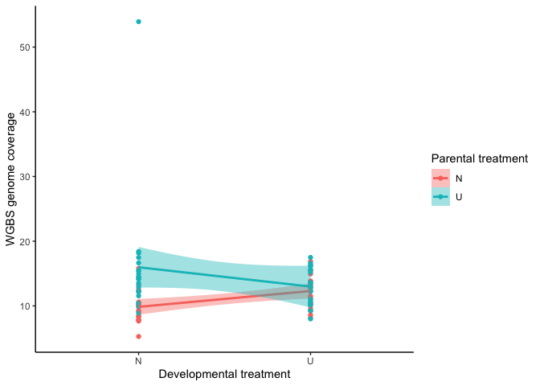
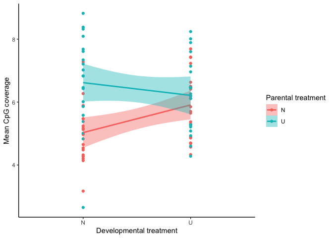
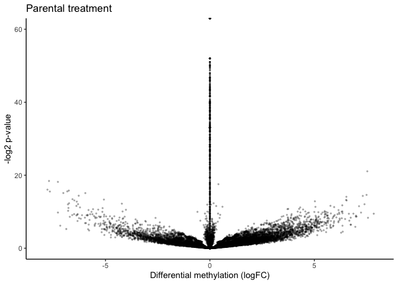
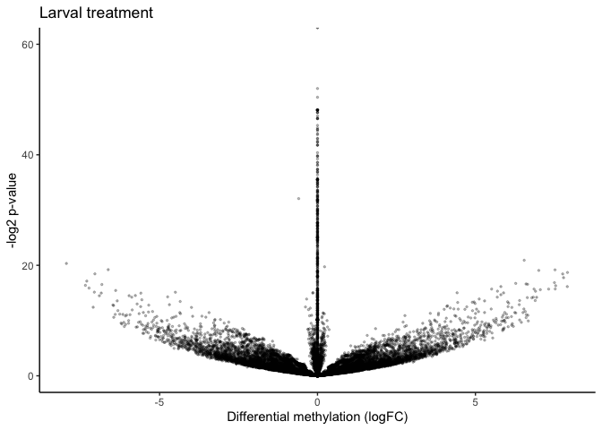

June ’25 Cross pHox WGBS update
================
Sam Bogan
2025-06-23

## Updates

I’ve finally gotten around to working up the Cross pHox WGBS data. We
have 78 libraries from 78 cultures. I’ve looked across the literature
and, to my knowledge, this is the largest single WGBS data set for
plants and animals in terms of samples per species (excluding humans).
We have RNA-seq data for 76/78 WGBS samples. When planning our
sequencing, we targeted an average coverage of 10x. Our mean coverage
was 12.85x (yay!) with a minimum of 5.27x and a max of 53.93x (Fig. 1). That high
coverage sample is probably the result of unequal loading by Novogene. Bisulfite conversion was very effective with a mean coversion rate
of 99.68% and a minimum of 99.54%.

I ran alignment and methylation calling according to this workflow by
Steve Roberts and Yaamini Venkataraman on our MarineOmics site:
<https://marineomics.github.io/FUN_02_DNA_methylation.html>.

<!-- -->

**Figure 1** \| Whole genome coverage of raw WGBS libraries.

The goal of 10x whole-genome coverage was to get 3-6x coverage in all
samples at CpG sites after mapping. This benchmark was as low as 3x
because BS-seq mapping rates are generally low. Mean CpG coverage after
mapping was 5.98x with a min of 2.65x and a max of 8.82x (Fig. 2). We
pretty much hit our target, and this will allow us to get \~10x coverage
at whole features (exons and introns) rather than single CpGs.

<!-- -->

**Figure 2** \| WGBS coverage at CpGs after mapping.

A PCoA of the methylation data (transformed to normally distributed
M-values) showed strong clustering of the samples due to relatedness and
parental treatment (Fig. 3).

**Figure 3** \| Principle coordinates analysis (PCoA) of methylation M
values. Color corresponds to parental treatment. Solid lines connect
full sibling samples. Dashed lines connect half sibling samples.
Dimensions 1 and 2 explained 4.25% and 4.11% of variance in methylation.

There was significantly greater % CpG methylation in
larvae that developed under upwelling conditions (0.25% increase; p =
0.008263). I'm going to look at the other PCoA dimensions and see if there are any where samples cluster by larval treatment.

If we filter the data for CpGs with \>=3x coverage in \>=66% of samples,
we retain a data set of \~9.1 million CpGs. If we filter for \>=10x
coverage in at least \>=66% of samples, we retain a dataset of \~0.9
million CpGs. I’m currently analyzing the 9.1 million CpG \>=3x data
set. For comparison, the >=10x cutoff of the RRBS data produced ~250,000 CpGs.

I’m running differential methylation tests using relmatlmer(). The tests
are structured as an animal model using the same structure as the
RNA-seq paper. methylation varies as a function of parental environment,
larval environment, a random effect of Dam, a random effect of Sire, and
covariance attributed to relatedness. I’ve used a logit transform to
make the methylation proportion data normally distributed. I also
performed early analyses using log transform rather than logit transform,
which was a mistake. The logit transformed models are running and will be done in 2
days.

Early results from the log-transformed data showed significant DM
associated with both parental and larval upwelling (Figures 4-5).
Absolute fold changes of DM were significantly higher for parental
effects versus larval effects (p = 1.225e-08).

<!-- -->

**Figure 4** \| Volcano plot of differential methylation 
under parental upwelling in a sneak peek of 20,000 out of 9.1 million
CpGs. 4.5% of CpGs were differentially methylated after FDR correction
(918/20,000). You’ll notice an artifact in this plot where there are
high -log p-values with small logFC values. This is an artifact of using
log-transformed methylation proportions rather than logit-transformed
proportions. Rerunning the models with logit-transformed data to fix
this.

<!-- -->

**Figure 5** \| Volcano plot of differential methylation 
under parental upwelling in a sneak peek of 20,000 out of 9.1 million
CpGs. 3.9% of CpGs were differentially methylated after FDR correction
(779/20,000). Same artifact here.

## Next steps

I’ll share the final differential methylation results when they’re done.
In the meantime, we should discuss what we want the goals of this paper
to be. Below are three questions and related aims. I’m happy to
focus on a combination of these. Whatever we think is the most
impactful and important. Pursuing all aims in one
paper is probably too convoluted however.

**Q1** Are there pathways that exhibit correlations between differential
methylation and expression?

Aim 1A - Instead of taking a whole transcriptome/whole methylome
approach to this question like we did in the past, I would fit
structural equation models to identify significant
environment-\>methylation-\>expression paths and test whether genes in
these paths are enriched for specific GO terms.

Aim 1B - Structural equation models could also be fit to modules of
genes rather than single genes. This would identify WGCNA modules that
correlate with environmental changes in methylation.

**Q2** Are there significant
environment-\>methylation-\>expression-\>phenotype relationships during
plasticity?

Aim 2 - The canonical model for how methylation affects plasticity is
that an environmental cue triggers a change in methylation, this
triggers a change in expression, and that triggers a phenotypic change.
I could take the structural equation approach in Aim 1 and expand it to
include phenotypic data, allowing us to identify genes in significant
environment-methylation-expression-phenotype networks. We could do this
for all three phenotypes (size, biomineralization, abnormality).

**Q3** How heritable is DNA methylation? How much GxE in methylation
exists between developmental environments?

Aim 3 - This is a simple metric I can extract from the animal
models I’ve run. One more in-depth thing we could do is compare
methylation-expression-phenotype networks between
environmentally-induced differential methylation and genetic differences
in methylation between families.

**Q4** Is GxE in gene expression predicted by GxE in DNA methylation?

Aim 4 - Environmental changes in methylation are proposed to be one
molecular mechanism underpinning GxE in expression and phenotype. We
could test whether genotype-by-environment interactions shaping
methylation predict GxE in expression. This could be through
quantitative genetic models or we SNPs called from WGBS data.
